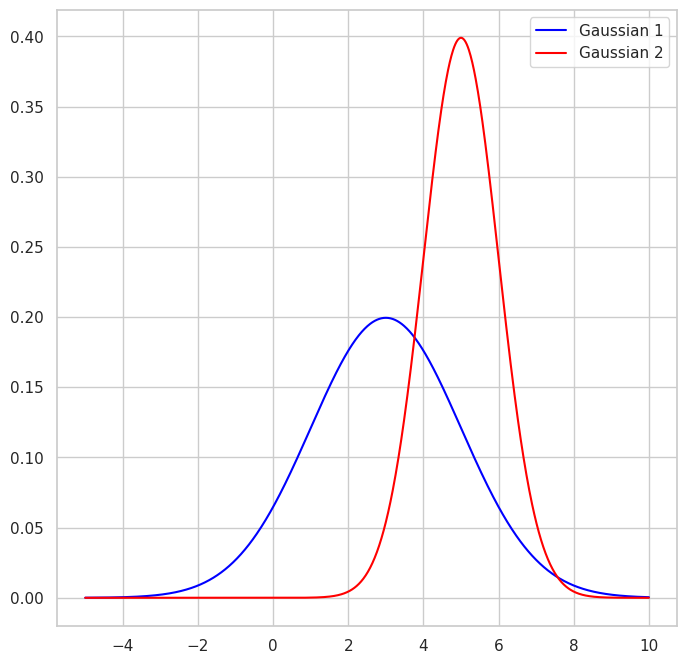

# Exercise 02: Neural Networks & Optimisation

<!---
ITU KSADMAL1KU-NLP - Advanced Machine Learning for NLP in KCS 2024

by Stefan Heinrich, Bertram Højer, Christian H. Rasmussen, & material by Kevin Murphy.

All info and static material: https://learnit.itu.dk/course/view.php?id=3024579
--->

For exercises in general: 
- No mandatory hand-ins, voluntary participation, but all lectures and exercises are relevant for to exam
- Help each other! Teaching others is the best form of learning
- Bertram, Christian, and Stefan are here to help
- Exercises should help you to learn - don't hesitate to find a work setting or extend with other material that works better for you 

Exercises are group work!
- Exercises best done in pairs of 2-3 people
- Try to gather in **different groups** every now and then

Exercise procedure:
- Meet in 2F13 at 12:30h
- Discuss findings from last week  you bring your solutions, questions, and issues
- Introduce current exercise sheet
- Supported free work

## Optional revision task 1: Understanding distributions

Consider the following two distributions. 

The x-axis indicates the number of days a delivery service takes to deliver your package. The blue curve is service 1, and the red curve is service 2. 

- Suppose you need to stay at home from work to receive your package, but want to miss as few working days as possible. Which service will you choose?
- As you can see, their delivery times follow Gaussian distributions. For service 1 (mu_1 = 5, sigma_1 = 1) and for service 2 (mu_2 = 3, sigma_2 = 2).  Every day you miss work, you lose 30 DKK. But Service 2 costs half of Service 1. Which service will you take?
- Optional for expert: The MLE for an univariate Gaussian is given by:
  
    $$\mu = \frac{1}{N}\sum_{n=1}^{N} y_n, \quad \sigma^2=\frac{1}{N}\sum_{n=1}^{N} (y_n-\mu)^2$$
    Can you explain the intuition? Or show the proof?

## Optional revision task 2: Recap notes on optimisation

Spend 10 min to recap on optimisation, e.g. by skimming over ch. 8 of [M-PML] and connecting this with today's lecture and the ML course from the BSc DS. Make some notes for the following questions:
- What is the main idea of optimisation?
- What is the meaning of the key aspects of optimisation: optimisation problem? loss function? parameter space? local/global optimum? 
- What is the mathematical idea of first-order gradient descent?
- How is gradient descent applied in the Backpropagation algorithm for training MLPs?
 
Once you are done, review and discuss one another's notes for 10 minutes. 

Now, as a group, expand:
- Research different optimisation algorithm variants (i.e., one person for one variant), including SGD + momentum, RPROP, Adagrad or RMSprop, and ADAM. Use the course literature and the tutorial websites of PyTorch or Tensorflow as starting points.
- Compare the differences in the mathematical ideas and empirical effect. 

  
## Optional revision task 3: Programming MLP basics with sklearn

In the following task we explore characteristics of training a Multilayer Perceptron (MLP). At first, we use the MLP implementation of the sklearn module *E02_regression_mlp_iris_sklearn.ipynb* (or in [Colab](https://colab.research.google.com/drive/1jyjoaycWwZKGLWYCJ2s5inCYdHndg69m)).

1. Empirically get familiar with the MLP, so test different layer sizes on the IRIS data. What configuration results in the best accuracy?

2. Test different learning rates, momentum, and number of training iterations. How do these basic hyperparameters affect the convergence to a high accuracy? What values are best?

## Task 4: MLP Programming tensorflow vs. pytorch

Now, secondly, we look into the implementation of an MLP in either of the major deep learning frameworks: Tensorflow or PyTorch. You can use the prepared notebooks in *E02_mlp_mnist_pytorch.ipynb* (or in [Colab](https://colab.research.google.com/drive/1fodwcnZmyKJTIxAXXorCABSkR3UKnTKo)) and *E02_mlp_mnist_tensorflow.ipynb* (or in [Colab](https://colab.research.google.com/drive/1gPiATb9FCjWVR8ATBAh2IV9CtoihdK7i)) for the start. 

1. Get familiar with either PyTorch or Tensorflow by reading through the API. Test different optimisers and loss functions on the MNIST data (feel free to change the implementation for testing on the IRIS data as well). What is the impact of hyperparameters on both performance AND speed?

2. Test different activation functions. How are loss function and activation function dependent?

